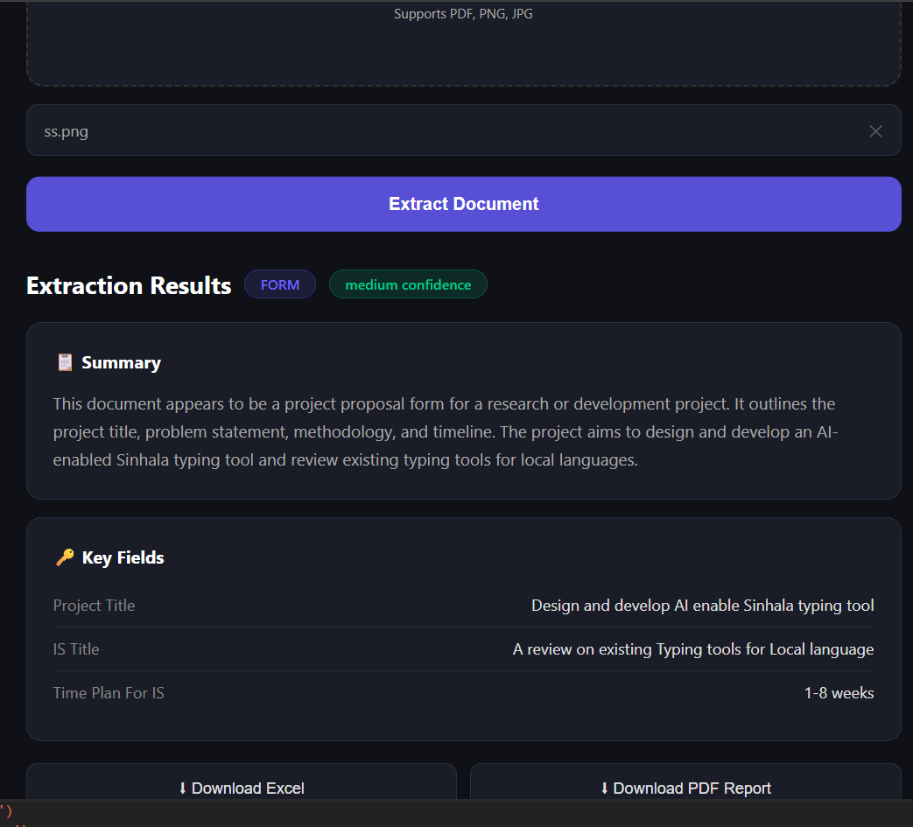

# 📄 DocuAgent — Live AI Document Extraction App

DocuAgent is an AI-powered web application that instantly extracts structured information from any document. Upload a PDF, PNG, or JPG and get a clean summary, key fields, and anomaly detection — all in seconds.

🔗 **Live Demo:** [malankatharula.github.io/DocuAgent](https://malankatharula.github.io/DocuAgent/)  
🔗 **API:** [malankabuilder-docuagent.hf.space](https://malankabuilder-docuagent.hf.space)

---

## 📸 Screenshot



---

## ✨ Features

- **AI Document Extraction** — Upload any document and get structured data instantly
- **Supports PDF, PNG, JPG** — PDFs are automatically converted and processed
- **Smart Classification** — Identifies document type (invoice, report, form, research paper, etc.)
- **Key Field Extraction** — Pulls relevant fields based on document type
- **Anomaly Detection** — Flags missing or unusual fields automatically
- **Export to Excel** — Download extracted data as a spreadsheet
- **Export to PDF Report** — Generate a formatted PDF report of the extraction
- **Drag & Drop UI** — Clean, responsive dark-themed interface

---

## 🛠️ Tech Stack

| Layer | Technology |
|---|---|
| Frontend | HTML, CSS, JavaScript |
| Backend | Python, FastAPI |
| AI Model | Groq API (Llama 4 Scout) |
| PDF Processing | pdf2image, Poppler |
| PDF Generation | ReportLab |
| Excel Export | SheetJS (XLSX) |
| Backend Hosting | Hugging Face Spaces (Docker) |
| Frontend Hosting | GitHub Pages |

---

## 🚀 Run Locally

**Prerequisites:** Python 3.11, pip

```bash
# Clone the repository
git clone https://github.com/malankatharula/DocuAgent.git
cd DocuAgent

# Create virtual environment
python -m venv venv
venv\Scripts\activate  # Windows
# source venv/bin/activate  # Mac/Linux

# Install dependencies
cd backend
pip install -r requirements.txt

# Set up environment variables
# Create a .env file in the backend folder:
# GROQ_API_KEY=your_groq_api_key_here

# Run the backend
uvicorn main:app --reload
```

Then open `frontend/index.html` in your browser.

Get a free Groq API key at [console.groq.com](https://console.groq.com)

---

## 📁 Project Structure

```
DocuAgent/
├── backend/
│   ├── main.py           # FastAPI backend with AI extraction logic
│   ├── requirements.txt  # Python dependencies
│   └── .env              # API keys (not committed)
├── frontend/
│   ├── index.html        # Main UI
│   ├── style.css         # Dark theme styles
│   └── script.js         # Frontend logic and API calls
├── .gitignore
└── README.md
```

---

## 🔌 API Endpoints

| Method | Endpoint | Description |
|---|---|---|
| GET | `/` | Health check |
| POST | `/extract` | Extract data from uploaded document |
| GET | `/export/json` | Download last extraction as JSON |
| GET | `/export/pdf` | Download formatted PDF report |

---

## 👤 Author

**H.Y.M.T.P Wickramasinghe (Malanka)**  
4th Year CS Undergraduate  
[GitHub](https://github.com/malankatharula) • [LinkedIn](https://www.linkedin.com/in/malanka-tharula-b329432a7)

---

## 📄 License

MIT License — feel free to use and modify.